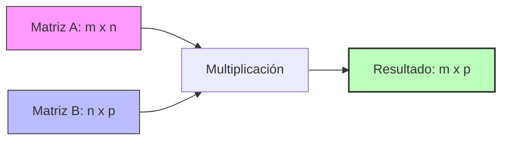

# Matemáticas Matriciales con NumPy

En computación científica y análisis de datos, las operaciones matemáticas sobre arreglos estructurados se dividen según sus dimensiones. NumPy permite realizar estos cálculos de forma eficiente y vectorizada.

---

## 1. Arreglos 1D: Vectores

Un arreglo unidimensional se conoce como **vector**. Dependiendo de la disposición de sus datos, puede ser un **vector fila** o un **vector columna**.

### Operaciones Elemento por Elemento (Element-wise)

Para sumar, restar o multiplicar dos vectores, estos deben tener exactamente la misma forma (`shape`). Las operaciones se aplican directamente sobre las posiciones correspondientes:

| Operación             | Representación Matemática / Visual                                                                                                                                      | Resultado en NumPy |
| :-------------------- | :---------------------------------------------------------------------------------------------------------------------------------------------------------------------- | :----------------- |
| **Suma de Vectores**  | $\begin{bmatrix} A_1 \\ A_2 \\ A_3 \end{bmatrix} + \begin{bmatrix} B_1 \\ B_2 \\ B_3 \end{bmatrix} = \begin{bmatrix} A_1 + B_1 \\ A_2 + B_2 \\ A_3 + B_3 \end{bmatrix}$ | `a + b`            |
| **Resta de Vectores** | $\begin{bmatrix} A_1 \\ A_2 \\ A_3 \end{bmatrix} - \begin{bmatrix} B_1 \\ B_2 \\ B_3 \end{bmatrix} = \begin{bmatrix} A_1 - B_1 \\ A_2 - B_2 \\ A_3 - B_3 \end{bmatrix}$ | `a - b`            |
| **Producto Escalar**  | $c \cdot \begin{bmatrix} A_1 \\ A_2 \\ A_3 \end{bmatrix} = \begin{bmatrix} c \cdot A_1 \\ c \cdot A_2 \\ c \cdot A_3 \end{bmatrix}$                                     | `c * a`            |

---

## 2. Arreglos 2D: Matrices

Un arreglo bidimensional se denomina **matriz** (compuesta por filas y columnas). Las operaciones de suma y resta elementales siguen las mismas reglas que los vectores, pero el producto matricial introduce el concepto de **producto punto (dot product)**.

### Producto Punto Matricial

El producto punto no se calcula elemento por elemento. Se obtiene multiplicando las filas de la primera matriz por las columnas de la segunda matriz y sumando sus resultados.

> **Regla de Dimensiones Ineludible:** Solo se puede multiplicar una matriz de dimensiones $m \times n$ con otra de $n \times p$. La matriz resultante tendrá una dimensión de $m \times p$.

